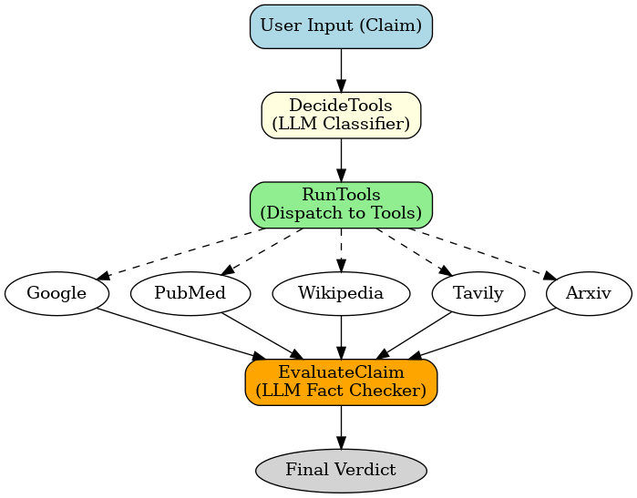
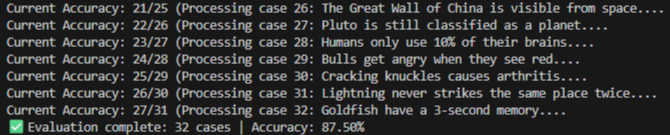
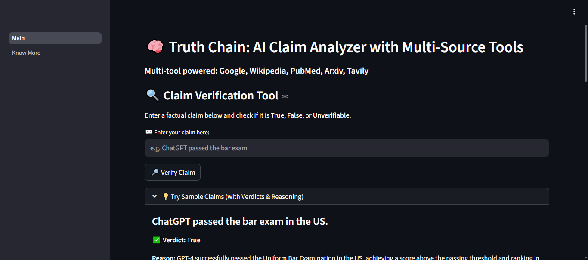
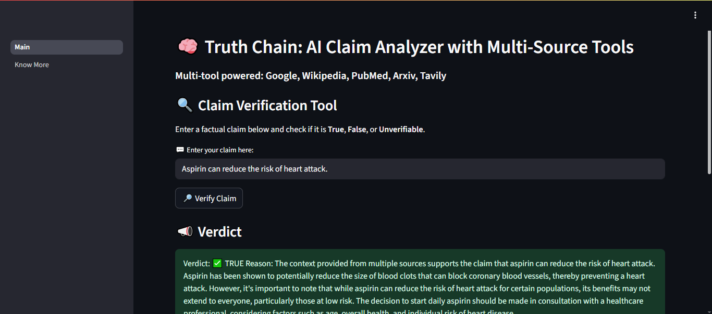
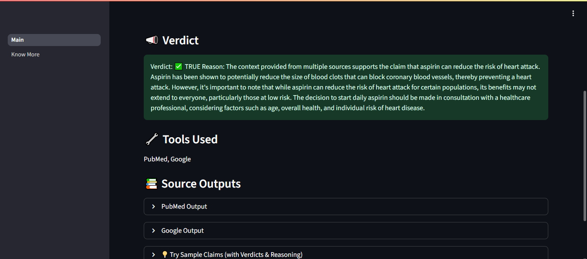

# 🧠 Truth Chain — AI Claim Analyzer

**Live Demo:** [truthchain.live](http://3.208.253.130:8502/)  
**Tech Stack:** Streamlit • LangGraph • OpenAI • Serper (Google) • PubMed • Arxiv • Wikipedia • Tavily

Truth Chain is an AI-powered **fact verification assistant**.  
Users enter a factual claim (e.g., *“ChatGPT passed the bar exam in the US”*).  
The system categorizes the claim, selects the most appropriate tools, fuses their evidence, and outputs a verdict:  
**✅ True**, **❌ False**, or **🤷 Unverifiable**, with reasoning and transparent sources.

---

## ✨ Features
- 🧠 **Smart Claim Categorization** — routes claims to the right tools.  
- 🔎 **Multi-Source Evidence** — Google, PubMed, Arxiv, Wikipedia, Tavily.  
- 📄 **Focused Summarization** — retrieves full articles (not just snippets) and compresses them relative to the claim.  
- 🧩 **LangGraph Orchestration** — modular tool routing + verdict reasoning.  
- 📊 **Evaluation Engine** — batch CSV claims → accuracy metrics.  
- 🌐 **Streamlit UI** — clean input form, expandable tool outputs, and a “Know More” page.  
- ☁️ **Hosted Live on AWS EC2** — accessible as a public demo, not just local.  
- ⚡ **Dual Model Support** — GPT-4o for maximum accuracy, GPT-4o-mini for cost-efficient hosting.  

---

## 🏗 Architecture
**Core Components:**
1. **Router Node** — LLM classifier decides relevant tools.  
2. **Tool Nodes** — query APIs (Google, PubMed, Arxiv, Wikipedia, Tavily).  
3. **Summarizers** — focus evidence on claim relevance.  
4. **Verdict Node** — LLM outputs True/False/Unverifiable + reasoning.  
5. **Evaluation Engine** — test claims from CSV, log accuracy.  
6. **UI** — Streamlit frontend for input, evidence, and results.  

---

### LangGraph Flow Diagram

---

## 📊 Evaluation
| Metric         | GPT-4o          | GPT-4o-mini     | Notes                               |
|----------------|-----------------|----------------|-------------------------------------|
| Accuracy       | **87.5%**       | **84.38%**     | 32 claims tested (Sept 11, 2025)    |
| Claims Correct | 28 / 32         | 27 / 32        | Logged in evaluation engine         |

**Takeaway:** GPT-4o provides the best accuracy.  
For hosting, **GPT-4o-mini** is used to reduce cost and latency while still maintaining strong accuracy.  

---

## 🖼 Screenshots

**Main Page & Sample Claim**  

  
  

**Verdict & Evidence Expansion**  

  
  

---

## ⚠ Limitations
- 📰 **Tavily under-utilization** — Router occasionally misses Tavily for breaking news if the claim lacks explicit time markers.  
- 🎯 **Model dependency** — Accuracy varies with LLM choice (**GPT-4o > GPT-4o-mini**).  
- 🌐 **Deployment polish** — Currently accessed via raw IP and port, without a custom domain or SSL.  

---

## 📅 Roadmap
- 🧭 **Smarter routing** — refine prompts and logic for better Tavily detection.  
- 🔄 **Fallback strategy** — automatically reroute to alternate sources if the first returns no evidence.  
- 🌍 **Deployment polish** — add custom domain + HTTPS for a professional demo.  
- 📊 **Dynamic metrics** — live statistics that update as more claims are analyzed.  
- 📚 **Mini RAG pipeline** — chunk longer sources and retrieve only the most relevant evidence for improved efficiency.  

---

## 🔒 Security
- `.env` is in `.gitignore`.  
- No API keys are committed.  
- Logs are rotated to avoid storage bloat.  

---

## 📜 Technical Details
For in-depth implementation details, see [TECHNICAL_DETAILS.md](TECHNICAL_DETAILS.md).  
Covers:  
- Tool APIs (Google, PubMed, Arxiv, Wikipedia, Tavily)  
- Claim-focused summarization logic  
- Router + verdict node orchestration (LangGraph)  
- Evaluation scripts and metrics tracking  
